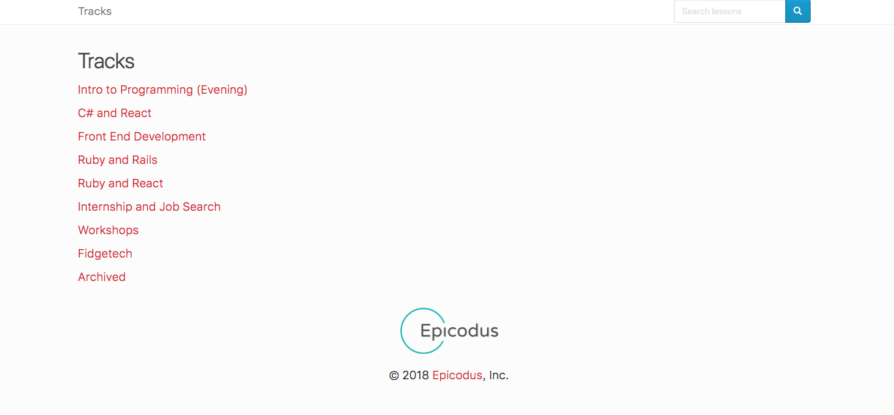
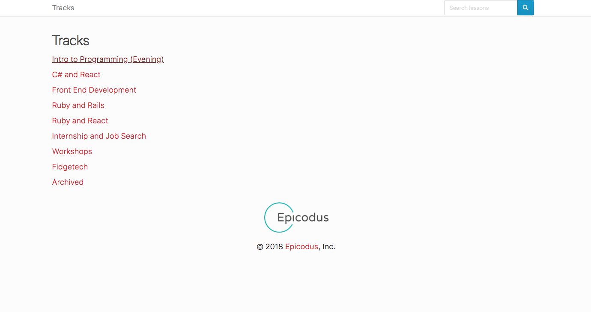
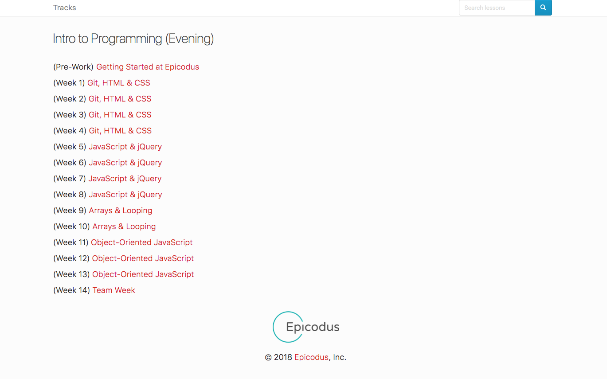
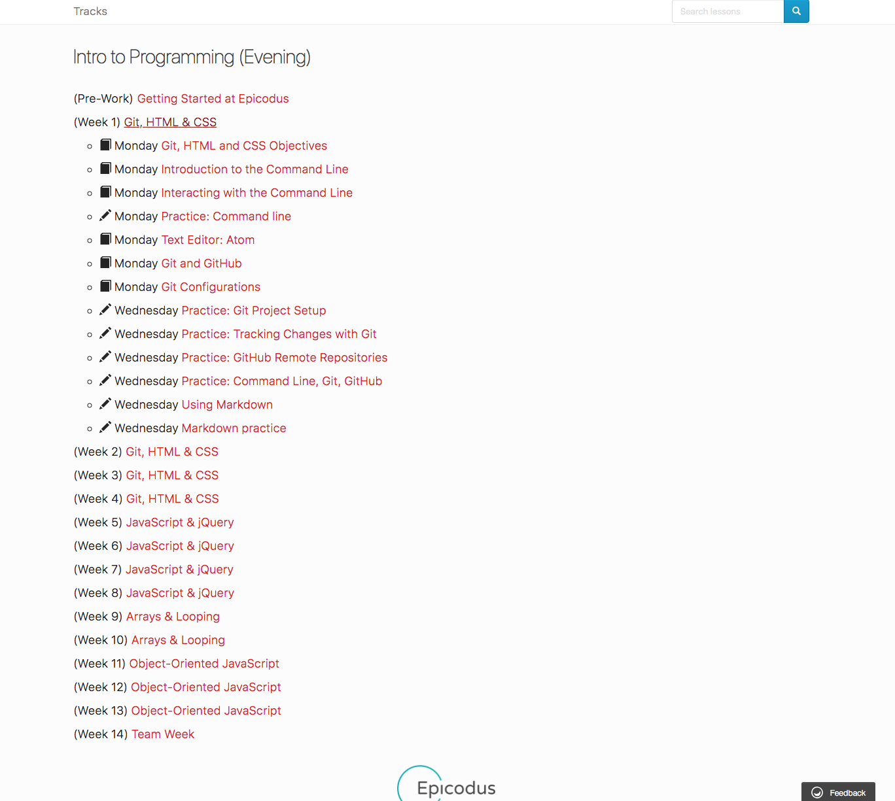
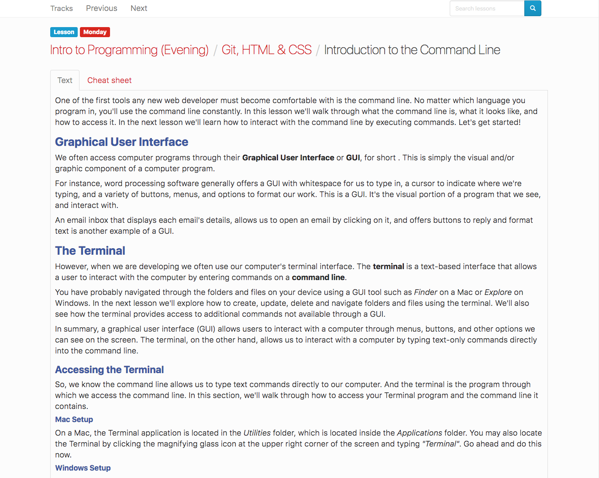
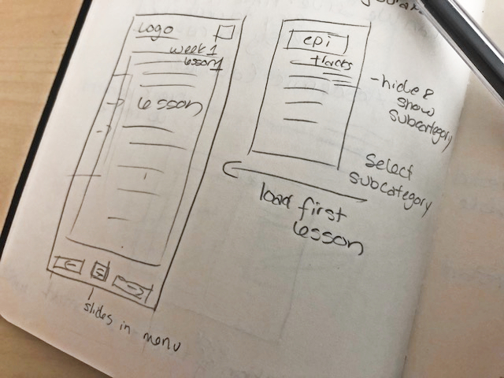
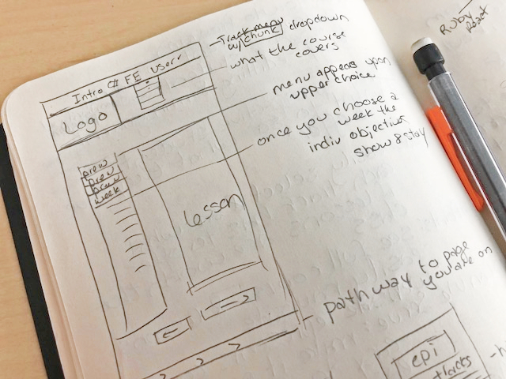

#### By _**Kendra Kelly & Joe**_

## Description

_This is a rebuild of the site learnhowtoprogram.com made using hand sketches, sketch low-fi wireframes, sketch hi-fi wireframes, protoyping, and coding._

## Setup/Installation Requirements

* _Clone this repository:_
* _Use Atom to edit html, css & javascript._
* _Sass for a preprocessor._
* _Sketch to view wireframes and prototypes._

## Screenshots

#### Original Site:
 | 
---------------------- | -----------------------
 | 
 |

#### Sketches:
Mobile | Desktop
:-----------------------: | :-----------------------:
 | 

#### Lo-Fi Wireframes:

#### Hi-Fi Wireframes:

#### Final Resign:

## User Profiles
User Profile 1 | User Profile 2 | User Profile 3
------------ | ------------- | -------------
Jeffrey Minios | Marnie Callum | Ralph Iwana
Prospective Student | Current  Student | Employer
"I want to see what they have to offer" | "I want to learn to program as easily as possible" | "I want to see what a prospective employee can be expected to know"
Painpoints: | Painpoints: | Painpoints:
* Wants to see full lessons and courses | * Always be able to see navigation | * Easily find summary
* Needs to be easily navigable | * Being able to navigate without moving backwards | * Not having to sort thru a lot of pages
* Nice looking - website represents the course |
How can we serve: | How can we serve: | How can we serve:
* Make it pretty | * Give full content | * Easy to understand
* Easy to understand | * Good way to navigate | * Easy navigation
* Easy to navigate |

## Support and contact details

_Please feel free to get in touch. Reach out to us at kendra@coffeeringsdesign.com & _

## Technologies Used

_Sketch, Bootstrap, JQuery, & Atom._

### License

*MIT*

Copyright (c) 2018 **_Kendra Kelly & _**
